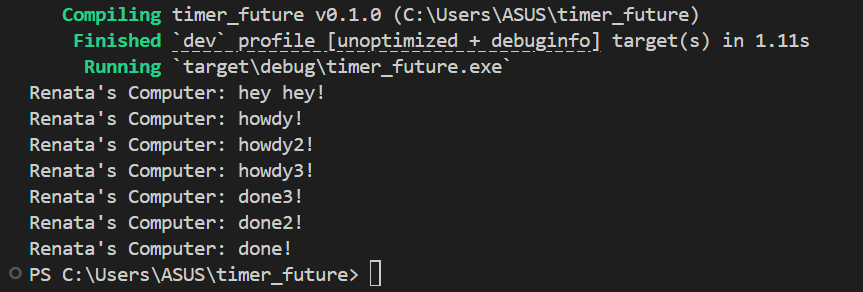
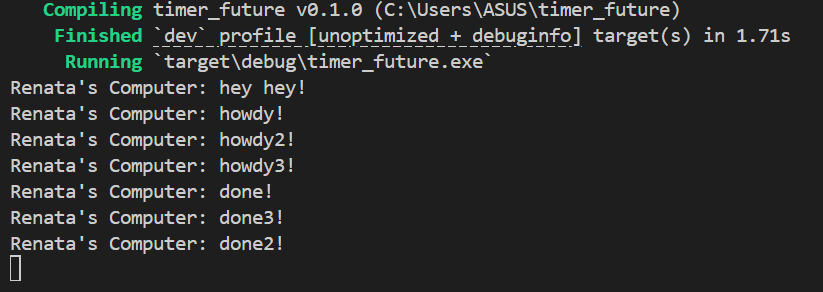

# Experiment 1.2: Understanding how it works

Setelah menambahkan satu println! tepat setelah spawner.spawn(...), urutan output program berubah. Output hey hey! muncul lebih dahulu dibandingkan howdy! walaupun kode async sudah dipanggil sebelumnya. Hal ini terjadi karena fungsi spawn() hanya memasukkan task async ke dalam queue milik executor, tetapi task tersebut belum langsung dijalankan saat itu juga. Program utama masih melanjutkan eksekusi kode sinkron biasa sebelum executor mulai menjalankan task-task async yang ada di queue. Setelah executor.run() dipanggil, executor mulai melakukan polling terhadap future dan menjalankan task async tersebut. Oleh karena itu, urutan eksekusinya menjadi: task dimasukkan ke queue, hey hey! dicetak, lalu executor menjalankan task async sehingga muncul howdy!, menunggu timer selesai, dan akhirnya mencetak done!.

# Experiment 1.3: Multiple Spawn and removing drop

Ketika beberapa spawn() ditambahkan, executor akan menerima lebih dari satu task async untuk dijalankan secara concurrent. Setiap pemanggilan spawn() membuat sebuah future baru dan memasukkannya ke dalam task queue. Saat executor.run() dijalankan, executor akan melakukan polling terhadap semua task tersebut hingga selesai. Karena semua task menggunakan timer async, beberapa task dapat berjalan secara bersamaan sehingga output done!, done2!, dan done3! bisa muncul dengan urutan yang berbeda-beda tergantung scheduling. Selain itu, ketika drop(spawner) dihapus, program tidak akan berhenti secara otomatis dan terlihat seperti hang. Hal ini terjadi karena channel pengirim task masih terbuka sehingga executor terus menunggu kemungkinan adanya task baru yang akan dikirim. Fungsi drop(spawner) berperan untuk menutup channel dan memberi tahu executor bahwa tidak akan ada task tambahan lagi. Dengan demikian, executor dapat keluar dari loop dan program dapat selesai dengan normal.