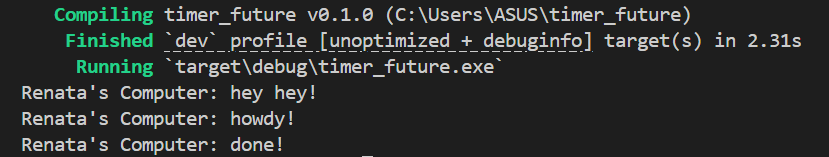

# Experiment 1.2: Understanding how it works

Setelah menambahkan satu println! tepat setelah spawner.spawn(...), urutan output program berubah. Output hey hey! muncul lebih dahulu dibandingkan howdy! walaupun kode async sudah dipanggil sebelumnya. Hal ini terjadi karena fungsi spawn() hanya memasukkan task async ke dalam queue milik executor, tetapi task tersebut belum langsung dijalankan saat itu juga. Program utama masih melanjutkan eksekusi kode sinkron biasa sebelum executor mulai menjalankan task-task async yang ada di queue. Setelah executor.run() dipanggil, executor mulai melakukan polling terhadap future dan menjalankan task async tersebut. Oleh karena itu, urutan eksekusinya menjadi: task dimasukkan ke queue, hey hey! dicetak, lalu executor menjalankan task async sehingga muncul howdy!, menunggu timer selesai, dan akhirnya mencetak done!.